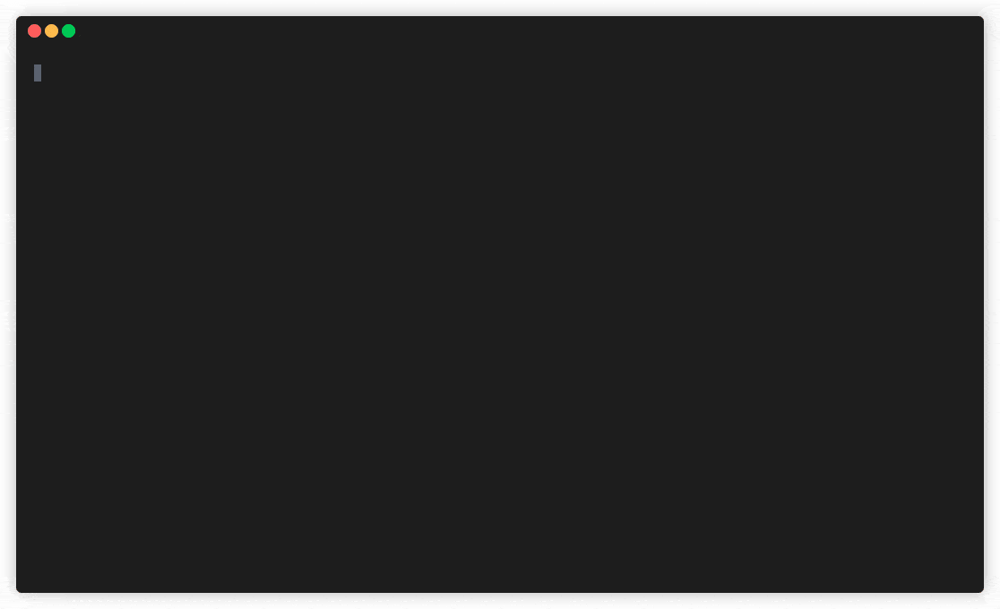

# `c19` – Get COVID-19 data with one command

[](https://github.com/xinyangyuan/c19/blob/master/LICENSE)
[](https://github.com/xinyangyuan/c19)

A simple cli to get COVID-19 data with one command.

## Usage

```
$ npx c19
```

## Demo


